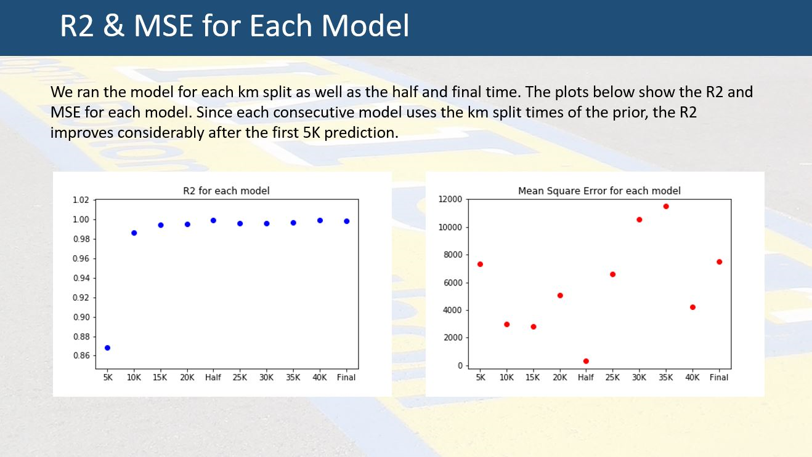

# Boston_Marathon

The software that we used during this project included:

- Visual Basics for Applications (VBA)
- Python
- Jupyter Notebook
- Visual Studio Code
- HTML
- Pickle from sklearn
- Pandas
- Numpy
- Joblib

The machine learning ("ML") models we tested before settling on linear regression included:

- Lasso
- Ridge
- ElasticNet

In this Machine Learning Group Project the team and I created models to calculate the splits of a Boston Marathon runner based on:

- Age
- Bib Number
- Gender
- Weather
- Projected Time

# Process

To start the project, we obtained Boston Marathon finishers data from 2015 through 2017.  Not all the finisher's data was complete regarding splits for each 5K interval of the 42.2K that make up a marathon.  Having times of zero seconds in our data would distort our analysis so those finishers were removed.  We also needed to combined the three years of data into one CSV file. Once the data was clean the next step was formatting the data for analysis.

The finisher's times at the 5K intervals was in hours, minutes, and seconds.  We converted all the times to seconds.  The gender was in the form of "male" and "female".  We converted to gender to "0"s and "1"s.  

The next step was to determine what attibutes would be used to train our models.  We decided to use bib number to capture the corral of the runner, gender, each of the 5K splits, and the half marathon split.  We also captured the temperature on the day of the race.  Moving on, we assigned the data set to a target, and split the data between training and testing datasets and settled on the liniar regression for our models.

# Residual Plots Comparing the Model with Bibs and Without.

After testing the model, we reviewed the residual plots to determine model accuracy. The residual is the difference between the actual value and the predicted value for each point of test data.

We tested to see if the bib number impacted the accuracy of the model predictions. The plots above show residuals with and without bib number. Since the R2 is better in the model on the left, bib number does impact the accuracy of the model.

We ran the model for each 5K split as well as the half and final time. The plots below show the R2 and mean squared error ("MSE") for each model. Since each consecutive model uses the 5K split times of the prior, the R2 improves considerably after the first 5K prediction. 
